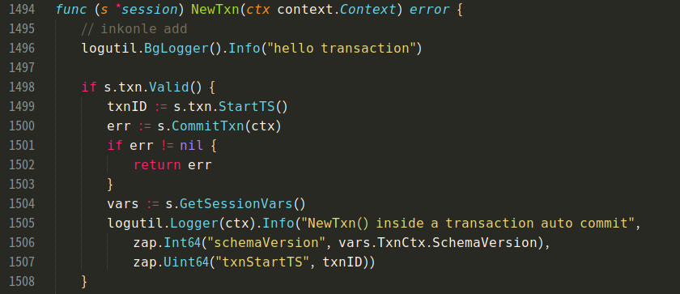

# 作业题目

### 题目描述

**本地下载TiDB，TiKV，PD源代码，改写源代码并编译部署以下环境：**

- 1. 1 TiDB
- 1. 1 PD
- 1. 3 TiKV

**改写后：**

- 使得TiDB启动事务时， 会打印一个“hello transaction”的日志


# 环境部署

OS: centOS 8

建立项目所需文件夹,GitHub clone 的项目都将建在此文件目录下

```
mkdir -p /root/data/tidb/src/github.com/pingcap
```

## 1.首先检查环境需要的工具

> To build TiKV you'll need to at least have the following installed:
>
> - `git` - Version control
>
> - [`rustup`](https://rustup.rs/) - Rust installer and toolchain manager
>
> - `make` - Build tool (run common workflows)
>
> - `cmake` - Build tool (required for gRPC)
>
> - `awk` - Pattern scanning/processing language

#### 安装gcc，g++和make

安装开发工具包，包括gcc,g++和make

```
sudo dnf group install "Development Tools"
```

使用gcc --verison 打印GCC版本来验证是否成功安装GCC编译器

```
gcc --version
```

#### 安装git，cmake和 go

```
yum install git cmake3 golang -y 
ln -s /usr/bin/cmake3 /usr/bin/cmake
```

#### 安装 rustup

```shell
curl https://sh.rustup.rs -sSf | sh
```

#### 安装mysql

1、Mysql 官网下载 RPM 包

```shell
wget https://dev.mysql.com/get/mysql80-community-release-el8-1.noarch.rpm
```

2、检查是否已安装（强力卸载）

```shell
for i in $(rpm -qa|grep mysql);do rpm -e $i --nodeps;done
rm -rf /var/lib/mysql && rm -rf /etc/my.cnf && rm -rf /usr/share/mysql
备注：可配合以下方式查找
whereis mysql
find / -name mysql
yum remove mysql mysql-server mysql-libs
```

3、安装 rpm 包

```
yum localinstall mysql80-community-release-el8-1.noarch.rpm
```

4、yum 安装

```shell
yum update
yum install mysql-server
```

5、查看 mysql 是否安装成功

```shell
ps -ef | grep mysql
mysqladmin --version
```

6、启动 mysql 服务

```shell
systemctl start mysqld
systemctl enable mysqld
systemctl status mysqld
```

7、相关安装目录

```shell
/usr/bin //相关命令
/usr/share/mysql //配置文件目录
/var/lib/mysql //数据库文件存放目录

/etc/my.cnf.d //mysql的启动配置文件
* client.cnf //mysql客户端配置文件
* mysql-server.cnf //mysql守护进程配置文件
* mysql-default-authentication-plugin.cnf //默认权限授权配置文件
备注：
可复制一份到/etc下，修改成my.cnf
```

8、mysql 登录（不用密码登录)

```shell
mysql -uroot
```

## 2.编译TiKV

官网提供编译安装步骤： https://github.com/tikv/tikv/blob/master/CONTRIBUTING.md

进入到项目目录，clone TiKV，配置Rust，编译

```shell
cd /root/data/tidb/src/github.com/pingcap
git clone https://github.com/tikv/tikv.git
cd tikv
# Future instructions assume you are in this directory
rustup component add rustfmt
rustup component add clippy
make build
```

TiKV编译完成，可找到执行文件

`/root/data/tidb/src/github.com/pingcap/tidk/target/debug/tikv-server`

## 3.编译TiDB

进入到项目目录，clone TiDB，编译

```shell
cd /root/data/tidb/src/github.com/pingcap
git clone https://github.com/pingcap/tidb.git
cd tidb
# Use proxy
export GOPROXY=https://mirrors.aliyun.com/goproxy/
make
```

TiDB编译完成，可找到执行文件

`/root/data/tidb/src/github.com/pingcap/tidb/bin/tidb-server`

## 4.编译PD

进入到项目目录，clone PD，编译

```shell
cd /root/data/tidb/src/github.com/pingcap
git clone https://github.com/pingcap/pd.git
cd pd
# Use proxy
export GOPROXY=https://mirrors.aliyun.com/goproxy/
make
```

TiDB编译完成，可找到执行文件

`/root/data/tidb/src/github.com/pingcap/pd/bin/pd-recover`

`/root/data/tidb/src/github.com/pingcap/pd/bin/pd-ctl`

`/root/data/tidb/src/github.com/pingcap/pd/bin/pd-server`


# 运行系统

编译完成之后，为了使用方便，将tidb,pd,tikv编译后生成的可执行程序(`pd-server,tikv-server,tidb-server`)均拷贝到`/root/data/tidb/bin`目录下。

1.启动顺序

PD->TiKV->TiDB

进入bin目录

```shell
cd /root/data/tidb/bin
# Future instructions assume you are in this directory
```

2.启动PD

```
./pd-server
```

3.启动TiKV

```
#启动第一台
./tikv-server --addr 127.0.0.1:10927 --status-addr 127.0.0.1:20181  --labels host="tikv1" 
#启动第二台
./tikv-server --addr 127.0.0.1:10928 --status-addr 127.0.0.1:20182  --labels host="tikv2" --data-dir=db2
#启动第三台
./tikv-server --addr 127.0.0.1:10929 --status-addr 127.0.0.1:20183  --labels host="tikv3" --data-dir=db3
```

4.启动TiDB

```
./tidb-server --advertise-address=10.204.246.196  --store=tikv --path=127.0.0.1:2379
```

5.访问TiDB数据库并检查

```shell
mysql --host 127.0.0.1 --port 4000 -u root
#####
Welcome to the MySQL monitor.  Commands end with ; or \g.
Your MySQL connection id is 1
Server version: 5.7.25-TiDB-v4.0.0-beta.2-960-g5184a0d70 TiDB Server (Apache License 2.0) Community Edition, MySQL 5.7 compatible

Copyright (c) 2000, 2019, Oracle and/or its affiliates. All rights reserved.

Oracle is a registered trademark of Oracle Corporation and/or its
affiliates. Other names may be trademarks of their respective
owners.

Type 'help;' or '\h' for help. Type '\c' to clear the current input statement.
#####
mysql>  USE information_schema;
#####
Reading table information for completion of table and column names
You can turn off this feature to get a quicker startup with -A

Database changed
#####
mysql>  SELECT * FROM cluster_info;
#####
+------+---------------------+----------------------+--------------+------------------------------------------+---------------------------+--------------------+
| TYPE | INSTANCE            | STATUS_ADDRESS       | VERSION      | GIT_HASH                                 | START_TIME                | UPTIME             |
+------+---------------------+----------------------+--------------+------------------------------------------+---------------------------+--------------------+
| tidb | 10.204.246.196:4000 | 10.204.246.196:10080 | 4.0.0-beta.2 | 5184a0d7060906e2022d18f11532f119f5df3f39 | 2020-08-15T20:00:25-03:00 | 2h40m24.744124457s |
| pd   | 127.0.0.1:2379      | 127.0.0.1:2379       | 4.1.0-alpha  | 865fbd82a028aecfb875a20b932fee3ba4b8c73c | 2020-08-15T19:58:19-03:00 | 2h42m30.744138279s |
| tikv | 127.0.0.1:10927     | 127.0.0.1:20181      | 4.1.0-alpha  | ae7a6ecee6e3367da016df0293a9ffe9cc2b5705 | 2020-08-15T19:59:09-03:00 | 2h41m40.744139242s |
| tikv | 127.0.0.1:10928     | 127.0.0.1:20182      | 4.1.0-alpha  | ae7a6ecee6e3367da016df0293a9ffe9cc2b5705 | 2020-08-15T19:59:45-03:00 | 2h41m4.744140068s  |
| tikv | 127.0.0.1:10929     | 127.0.0.1:20183      | 4.1.0-alpha  | ae7a6ecee6e3367da016df0293a9ffe9cc2b5705 | 2020-08-15T20:00:03-03:00 | 2h40m46.744140934s |
+------+---------------------+----------------------+--------------+------------------------------------------+---------------------------+--------------------+
5 rows in set (0.02 sec)
```

6.检查集群

进入交互模式

```
./pd-ctl -i 

» store
{
  "count": 3,
  "stores": [
    {
      "store": {
        "id": 1,
        "address": "127.0.0.1:10927",
        "labels": [
          {
            "key": "host",
            "value": "tikv1"
          }
        ],
        "version": "4.1.0-alpha",
        "status_address": "127.0.0.1:20181",
        "git_hash": "ae7a6ecee6e3367da016df0293a9ffe9cc2b5705",
        "start_timestamp": 1597532349,
        "deploy_path": "/root/data/tidb/bin",
        "last_heartbeat": 1597541630901730391,
        "state_name": "Up"
      },
      "status": {
        "capacity": "35.03GiB",
        "available": "12.02GiB",
        "used_size": "32.76MiB",
        "leader_count": 14,
        "leader_weight": 1,
        "leader_score": 14,
        "leader_size": 14,
        "region_count": 22,
        "region_weight": 1,
        "region_score": 22,
        "region_size": 22,
        "start_ts": "2020-08-15T19:59:09-03:00",
        "last_heartbeat_ts": "2020-08-15T22:33:50.901730391-03:00",
        "uptime": "2h34m41.901730391s"
      }
    },
    {
      "store": {
        "id": 4,
        "address": "127.0.0.1:10928",
        "labels": [
          {
            "key": "host",
            "value": "tikv2"
          }
        ],
        "version": "4.1.0-alpha",
        "status_address": "127.0.0.1:20182",
        "git_hash": "ae7a6ecee6e3367da016df0293a9ffe9cc2b5705",
        "start_timestamp": 1597532385,
        "deploy_path": "/root/data/tidb/bin",
        "last_heartbeat": 1597541627034611795,
        "state_name": "Up"
      },
      "status": {
        "capacity": "35.03GiB",
        "available": "12.02GiB",
        "used_size": "32.75MiB",
        "leader_count": 4,
        "leader_weight": 1,
        "leader_score": 4,
        "leader_size": 4,
        "region_count": 22,
        "region_weight": 1,
        "region_score": 22,
        "region_size": 22,
        "start_ts": "2020-08-15T19:59:45-03:00",
        "last_heartbeat_ts": "2020-08-15T22:33:47.034611795-03:00",
        "uptime": "2h34m2.034611795s"
      }
    },
    {
      "store": {
        "id": 6,
        "address": "127.0.0.1:10929",
        "labels": [
          {
            "key": "host",
            "value": "tikv3"
          }
        ],
        "version": "4.1.0-alpha",
        "status_address": "127.0.0.1:20183",
        "git_hash": "ae7a6ecee6e3367da016df0293a9ffe9cc2b5705",
        "start_timestamp": 1597532403,
        "deploy_path": "/root/data/tidb/bin",
        "last_heartbeat": 1597541625320647249,
        "state_name": "Up"
      },
      "status": {
        "capacity": "35.03GiB",
        "available": "12.02GiB",
        "used_size": "32.75MiB",
        "leader_count": 4,
        "leader_weight": 1,
        "leader_score": 4,
        "leader_size": 4,
        "region_count": 22,
        "region_weight": 1,
        "region_score": 22,
        "region_size": 22,
        "start_ts": "2020-08-15T20:00:03-03:00",
        "last_heartbeat_ts": "2020-08-15T22:33:45.320647249-03:00",
        "uptime": "2h33m42.320647249s"
      }
    }
  ]
}


```

# 改写

在 `tidb/session/session.go` 中 NexTxn()函数增加打印 `logutil.BgLogger().Info("hello transaction")`语句，即可实现功能。



日志如下

```
[2020/08/16 22:00:58.212 +08:00] [INFO] [session.go:1496] ["hello transaction"]
[2020/08/16 22:00:58.224 +08:00] [INFO] [session.go:1496] ["hello transaction"]
[2020/08/16 22:00:58.233 +08:00] [INFO] [session.go:1496] ["hello transaction"]
[2020/08/16 22:00:58.239 +08:00] [INFO] [session.go:1496] ["hello transaction"]
```

